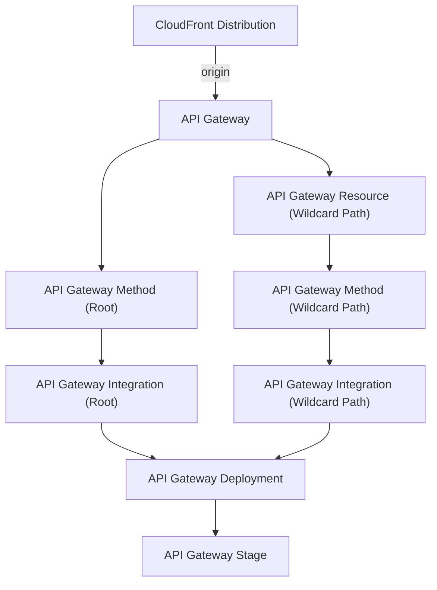

This is a [Next.js](https://nextjs.org/) project bootstrapped with [`create-next-app`](https://github.com/vercel/next.js/tree/canary/packages/create-next-app).

## Getting Started

First, run the development server:

```bash
npm run dev
# or
yarn dev
# or
pnpm dev
```

Open [http://localhost:3000](http://localhost:3000) with your browser to see the result.

You can start editing the page by modifying `app/page.tsx`. The page auto-updates as you edit the file.

This project uses [`next/font`](https://nextjs.org/docs/basic-features/font-optimization) to automatically optimize and load Inter, a custom Google Font.





cloud front
↓
API Gateway
↓
lambda（next.jsのimage）

の順で処理される。


lambdaのimageはlambda専用のものしか使えない


execコマンドとは？

デプロイ方法


認証
```
make exec-vault
```

```
npm run build
```

ビルド
```
docker build -t next_sample . --platform linux/amd64
```

タグをECR用にする
```
docker tag next_sample:latest 945895768821.dkr.ecr.ap-northeast-1.amazonaws.com/sample_lambda_repo
```


```
aws ecr get-login-password --region ap-northeast-1 --profile private-user | docker login --username AWS --password-stdin 945895768821.dkr.ecr.ap-northeast-1.amazonaws.com
```

```
docker push 945895768821.dkr.ecr.ap-northeast-1.amazonaws.com/sample_lambda_repo
```

```
aws lambda update-function-code --function-name sampleLambdaRepo --image-uri 945895768821.dkr.ecr.ap-northeast-1.amazonaws.com/sample_lambda_repo:latest
```